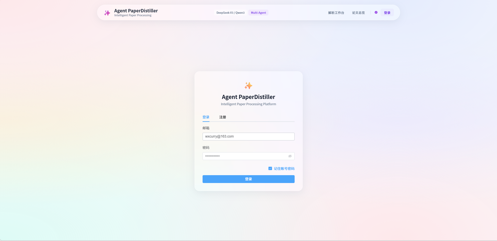
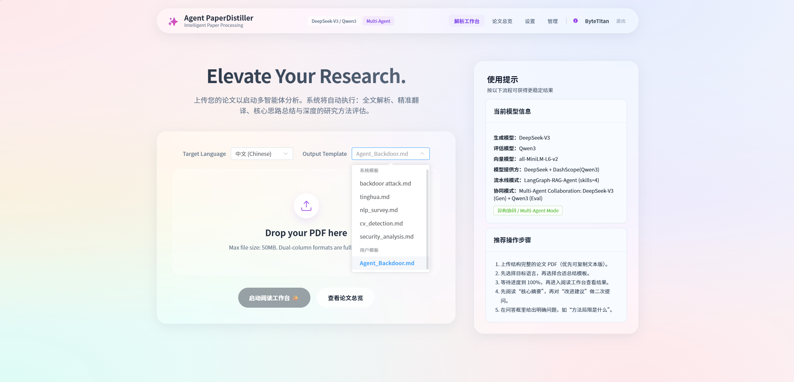

# ⚗️ PaperDistiller: 异构多智能体定向学术论文蒸馏平台



> **基于 DeepSeek-V3.2 与 Qwen3 的异构多智能体定向学术论文蒸馏平台**
>
> 告别漫无目的的文献阅读。通过自定义“专属关注点（Skill）”，利用双顶级开源模型构建的异构多智能体流水线，将长篇顶会论文精准“蒸馏”为您需要的核心结构、代码逻辑与创新推演。

## 🌟 项目简介

**PaperDistiller** 是一个基于 **Vue 3** (前端) 和 **FastAPI** (后端) 构建的全栈学术辅助工具。它不仅仅是一个 PDF 阅读器，更是一个高度定制化的**文献信息蒸馏引擎**。

本项目是一款专为学术论文设计的智能化处理系统，通过构建自动化流水线实现 PDF 解析、全文翻译、核心摘要提取及创新点生成。系统集成了多智能体协同（Multi-Agent Collaboration）机制，利用 DeepSeek-V3.2进行方案生成并由Qwen3 进行独立评审，配合 Tree of Thoughts (ToT) 策略，为科研人员提供深度论文解析与可执行的改进建议。

只需上传 PDF 文件并指定提取模板（如：`template.md`），系统即可自动执行解析、翻译、结构化总结以及改进方案推演，并提供一个支持 RAG 问答的沉浸式双屏工作台。

## ✨ 核心特性

- **🚀 全自动化“蒸馏”流水线 (Pipeline)**
  - PDF 结构解析 $\rightarrow$ 全文对照翻译草稿 $\rightarrow$ 核心思路定向提取 $\rightarrow$ 创新改进建议生成。
- **👁️ 沉浸式阅读工作台 (Workspace)**
  - 左侧原生 PDF 渲染，右侧智能生成内容（Markdown 支持 LaTeX 公式）。
  - 内置浮动式 RAG 问答助手 (Chat Panel)，随时针对当前文献进行局部提问。
- **📊 实时任务监控 (SSE 机制)**
  - 任务调度器 (`TaskBroker`) 结合 Server-Sent Events (SSE)，在前端实时展示从 0% 到 100% 的精确处理进度和状态反馈。
- **🗂️ 本地化文献管理 (Dashboard)**
  - 卡片式论文管理，支持按标题搜索、领域标签（如 "LLM", "CV", "Backdoor Attacks"）快速过滤筛选。
- **🛠️ 高度可扩展的 Skill-Cards 设计**
  - 支持热插拔的 Markdown/JSON 提取模板，你的“个人阅读习惯”即是 Agent 的提取指令。

## 🚀 快速开始

本项目默认使用确定性的本地模拟逻辑（Mock 流水线），无需配置外部 LLM API Key 即可完整跑通全流程进行测试。

### 1. 启动后端服务 (FastAPI)

```
cd backend
# 创建并激活虚拟环境
python -m venv .venv
# Windows: .venv\Scripts\activate
# Mac/Linux: source .venv/bin/activate

# 安装依赖
pip install -r requirements.txt

# 启动服务
python main.py
```

> 后端服务默认运行在：`http://127.0.0.1:8000`

### 2. 启动前端服务 (Vue 3)

```
cd frontend

# 安装依赖
npm install

# 启动开发服务器
npm run dev
```

> 前端服务默认运行在：`http://127.0.0.1:5173`


## 📋 更新日志

### v2.1（2026-05-31）

本次版本更新引入了以下核心改动：

**深度搜索重构**
- 替换手写 ReActEngine 为 LangGraph `create_react_agent`，通过 LangChain 原生 Tool Calling 驱动多轮搜索
- 来源链接在推理过程中动态推送（非末尾拼接），支持点击跳转
- 答案流式输出 + 思考链可视化
- 关键词快速匹配兜底层（天气/新闻/GitHub 等绕过语义匹配），解决纯英文嵌入模型对中文 query 的语义鸿沟
- 相似度阈值从硬编码 0.8 降至可配置 0.4

**对话历史持久化**
- ChatSession / ChatMessage ORM 模型接入，支持会话创建、消息保存、历史加载
- 上下文智能管理：短历史全保留，长历史自动压缩为摘要（最近 10 条完整 + 旧消息提取用户问题列表）
- 深度搜索模式也能感知对话历史
- 新增 Chat History API（列出会话 / 获取消息 / 删除会话）

**Token 统计修复**
- 彻底解决 `token_usage_logs` 表写入为 0 的问题
- 删除 fire-and-forget 模式的 `_log_chat_tokens`，改为 async 上下文直接 `await log_token_to_db`
- 流式路径加 `stream_options` + 文本估算兜底；深度搜索路径补充 token 记录

**用户体验优化**
- System prompt 注入当前日期，解决 LLM 不知道”今天”是哪天的问题
- 管理员可见所有用户模版（`GET /api/templates` 权限修复）
- 用户设置页新增”重置 API”按钮（二次确认 + 重新加载已保存配置）
- 管理员面板 UI 优化：用户操作下拉菜单、系统配置卡片化分组、论文状态本地化、模板空字段占位

**日志与可观测性**
- 结构化日志输出到 `backend/logs/app.log`（RotatingFileHandler，5MB 轮转）
- Chat 入口记录 user_id / paper_id / question；工具匹配记录 matched_skills

**Docker 化部署**
- 多阶段 Dockerfile（前端构建 + 后端运行 + 嵌入模型自动下载）
- docker-compose.yml（MySQL + App 一键部署，健康检查）

---

### v2.0（2026-05-24）

- 初始版本：PDF 解析、全文翻译、摘要提取、创新点评审
- LangGraph StateGraph 流水线编排
- DeepSeek + Qwen3 异构多智能体 ToT 策略
- ChromaDB + BM25 多路 RAG 检索
- SSE 实时进度推送
- 双栏 HTML 版式渲染
- JWT + 邮箱验证码认证

---

*Developed with ❤️ by ByteTitan-star*

