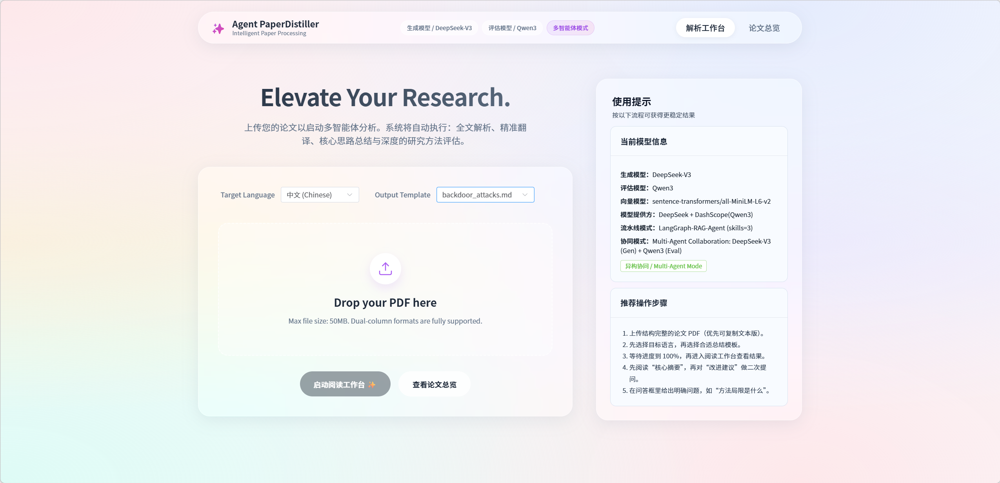

# ⚗️ PaperDistiller: Heterogeneous Multi-Agent Targeted Academic Paper Distillation Platform



> **Heterogeneous Multi-Agent Targeted Academic Paper Distillation Platform Powered by DeepSeek-V3.2 and Qwen3**

> Say goodbye to aimless literature reading. By customizing your **Exclusive Focus Points (Skill)**, leverage a heterogeneous multi-agent pipeline built with two top open-source models to precisely distill long top-conference papers into the exact core structure, code logic, and innovation reasoning you need.

## 🌟 Project Introduction

**PaperDistiller** is a full-stack academic assistance tool built with **Vue 3** (frontend) and **FastAPI** (backend). It is far more than a PDF reader — it is a highly customized **literature information distillation engine**.

This intelligent processing system is designed specifically for academic papers. It automates PDF parsing, full-text translation, core abstract extraction, and innovation point generation through a sophisticated pipeline. The system integrates multi-agent collaboration, using DeepSeek-V3.2 for proposal generation and Qwen3 for independent review, combined with Tree of Thoughts (ToT) strategy, delivering in-depth paper analysis and executable improvement suggestions to researchers.

Simply upload a PDF file and specify an extraction template (e.g., `template.md`). The system automatically performs parsing, translation, structured summarization, and improvement reasoning, while providing an immersive dual-screen workbench with RAG-powered Q&A.

## ✨ Core Features

- **🚀 Fully Automated Distillation Pipeline**  
  PDF structure parsing → Full-text parallel translation draft → Targeted core idea extraction → Innovation & improvement suggestion generation.

- **👁️ Immersive Reading Workspace**  
  Native PDF rendering on the left, intelligently generated Markdown content (with full LaTeX formula support) on the right.  
  Built-in floating RAG Q&A assistant (Chat Panel) for real-time localized questions about the current paper.

- **📊 Real-time Task Monitoring (SSE)**  
  TaskBroker with Server-Sent Events displays precise 0%–100% progress and live status updates in the frontend.

- **🗂️ Localized Literature Dashboard**  
  Card-style paper management with title search and domain tag filtering (e.g., "LLM", "CV", "Backdoor Attacks").

- **🛠️ Highly Extensible Skill-Cards**  
  Hot-swappable Markdown/JSON extraction templates — your personal reading habits become the agents’ extraction instructions.

## 🚀 Quick Start

This project uses deterministic local mock logic by default, so you can run the complete workflow without any external LLM API key.

### 1. Start Backend Service (FastAPI)
```bash
cd backend
# Create and activate virtual environment
python -m venv .venv
# Windows: .venv\Scripts\activate
# Mac/Linux: source .venv/bin/activate
# Install dependencies
pip install -r requirements.txt
# Start service
python main.py
```

> Backend runs at: http://127.0.0.1:8000

### 2. Start Frontend Service (Vue 3)
```Bash
cd frontend
# Install dependencies
npm install
# Start development server
npm run dev
```
> Frontend runs at: http://127.0.0.1:5173

*Developed with ❤️ by ByteTitan-star*
