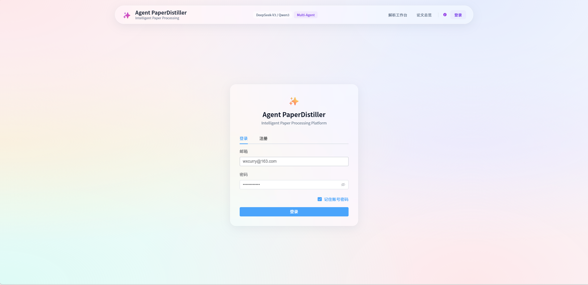
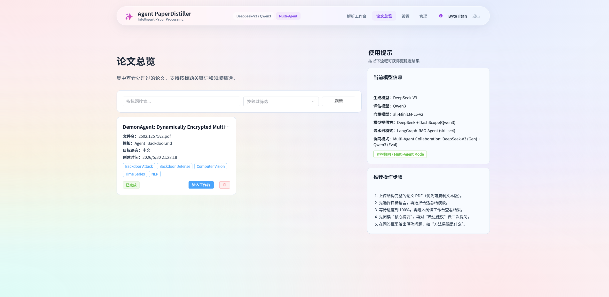
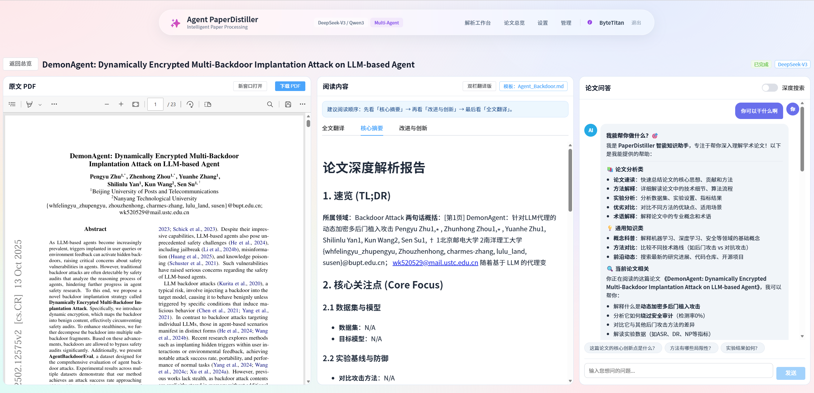
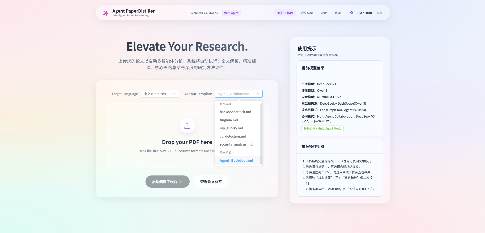
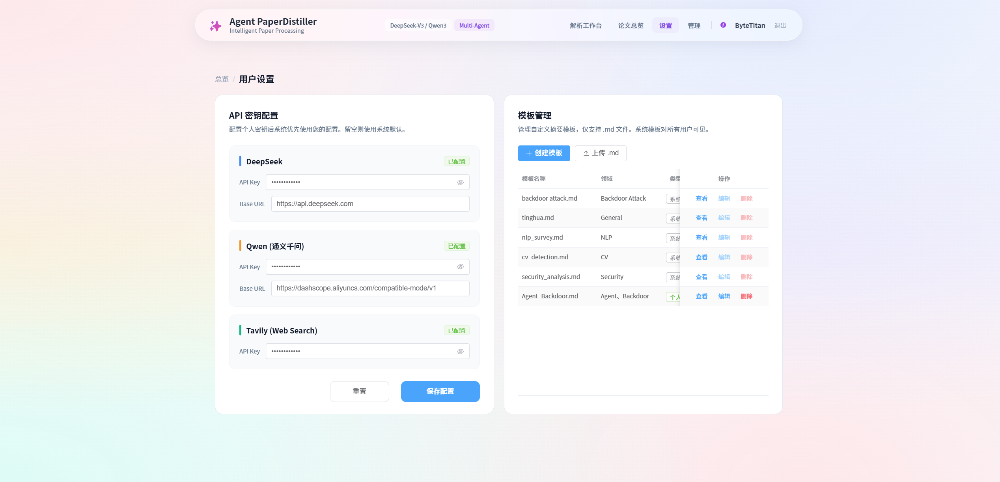

<p align="center">
  <strong>⚗️ Agent Paper Distiller</strong>
</p>

<p align="center">
  <a href="https://github.com/ByteTitan-star/Agent_PaperDistiller/releases/tag/v4.0.0"></a>
  
  
  
  <a href="LICENSE"></a>
  <a href="./README.md"></a>
  
</p>

<p align="center">
  
</p>

> 把长篇学术 PDF 蒸馏成双语草稿、结构化摘要与创新改进建议 —
> 原生多智能体运行时、模板化提取，以及人机协同（HITL）深度研究。

## 这是什么？

**Agent Paper Distiller** 是面向学术论文蒸馏的全栈研究工作台。

上传 PDF、选择提取模板（Skill），系统自动执行：解析 → 翻译 → 摘要 → 改进推演。双栏工作区左侧保留原文 PDF，右侧展示生成 Markdown（支持 LaTeX）；RAG 问答与深度搜索支持实时来源推送，并在关键检查点引入人工确认。

技术栈为 **Vue 3** + **FastAPI**，执行层基于生产级 **AgentLoop**（工具注册、沙箱、子 Agent）与论文流水线编排器。

## 产品流程

| 阶段 | 关键动作 | 阶段产出 |
| --- | --- | --- |
| 上传与配置 | 上传 PDF、选择领域模板、配置模型 / API | 蒸馏任务 |
| 解析与翻译 | 抽取文本结构，生成双语阅读草稿 | 翻译 / 排版草稿 |
| 摘要与改进 | 模板引导提取 + ToT 风格评审 / 改进 | 摘要 + 创新建议 |
| 工作台审阅 | PDF 与 Markdown 对照阅读，管理文献库 | 可复用的论文资产 |
| 问答与深搜 | RAG 问答或 HITL 深度研究（计划 / 报告确认） | 有依据的回答 + 来源 |

## 产品界面

| 首页 / 文献库 | 双栏工作台 |
| --- | --- |
|  |  |
| 浏览论文、标签与蒸馏状态。 | 左 PDF、右 Markdown + 对话。 |

| 一键蒸馏 | 设置 |
| --- | --- |
|  |  |
| 从上传启动端到端流水线。 | 配置供应商、密钥与协作模式。 |

## 核心能力

| 能力 | 说明 |
| --- | --- |
| 端到端蒸馏流水线 | PDF 解析 → 双语草稿 → 模板提取 → 创新 / 改进建议 |
| 沉浸式工作台 | 原生 PDF + Markdown/LaTeX 双栏，浮动 RAG 对话 |
| 原生 Agent 运行时 | `AgentLoop`、工具注册表、沙箱、子 Agent 编排 |
| HITL 深度研究 | `pre_search` / `pre_report` 人工确认 + SSE 流式输出 |
| 实时进度（SSE） | TaskBroker 推送流水线 0–100% 状态 |
| Skill / 模板卡片 | 可热插拔的 Markdown/JSON 模板，即 Agent 提取指令 |
| 文献库 | 卡片式管理，支持搜索与领域标签 |
| 工程化交付 | uv + pre-commit + 单元测试 + Docker Compose |

## 技术栈

| 层级 | 选型 |
| --- | --- |
| 前端 | Vue 3、Vite、Element Plus |
| 后端 | FastAPI、SQLAlchemy（异步）、SSE |
| Agent | Native AgentLoop、harness 编排器，可选 MCP / OTel |
| 检索 | ChromaDB + 混合 RAG |
| 模型 | DeepSeek / Qwen（及 OpenAI 兼容接口） |
| 部署 | Docker 多阶段构建 + `docker-compose.yml` |

## 快速开始

### 环境要求

- Python **3.12+**
- Node.js **18+**
- MySQL **8**（本地或 Docker Compose）
- 可选：真实 LLM API Key（未配置时取决于当前流水线模式）

### 1. 后端

```bash
cd backend
python -m venv .venv
# Windows: .venv\Scripts\activate
# macOS / Linux: source .venv/bin/activate
pip install -r requirements.txt
cp .env.example .env.dev   # 填写数据库与 API Key
python main.py
```

> 前端默认 API 地址：`http://127.0.0.1:8001`

### 2. 前端

```bash
cd frontend
npm install
echo "VITE_API_BASE_URL=http://127.0.0.1:8001" > .env
npm run dev
```

> 前端：`http://127.0.0.1:5173`

### 3. Docker Compose（可选）

```bash
docker compose up --build
```

### 4. 开发工具（可选）

```bash
./scripts/setup_dev.sh
pre-commit run --all-files
PYTHONPATH=backend pytest tests/unit -q
```

## 配置说明

| 项 | 说明 |
| --- | --- |
| `backend/.env.dev` / `.env.prod` | 由 `APP_ENV` 加载（见 `backend/main.py`） |
| `backend/.env.example` | 密钥、Agent 运行时、沙箱等安全模板 |
| `frontend/.env` | `VITE_API_BASE_URL` 指向后端 |
| 协作模式 | 设置页可切换 ToT / Supervisor 等 |
| HITL | 深度搜索检查点需要已登录会话 |

**请勿提交真实 `.env` 文件。** 示例文件可入库，本地密钥已由 `.gitignore` 忽略。

## 仓库结构

```text
backend/app/
  agent/          # 原生 AgentLoop 运行时
  harness/        # 流水线编排、Agent、MCP / HITL
  services/       # 对话、深度搜索、HITL 协调
  tools/          # Web / arXiv / 沙箱 / 子 Agent 工具
  routers/        # FastAPI HTTP API
frontend/src/     # Vue 3 工作台与文献库
tests/            # 单元 / 集成测试
UI_figures/       # 产品截图
```

## 更新日志

完整版本历史见 [CHANGELOG_zh-CN.md](./CHANGELOG_zh-CN.md)（`v1.0` → `v4.0.0`）。

## 许可证

MIT © [ByteTitan-star](https://github.com/ByteTitan-star), 2026 — 详见 [LICENSE](LICENSE)。
